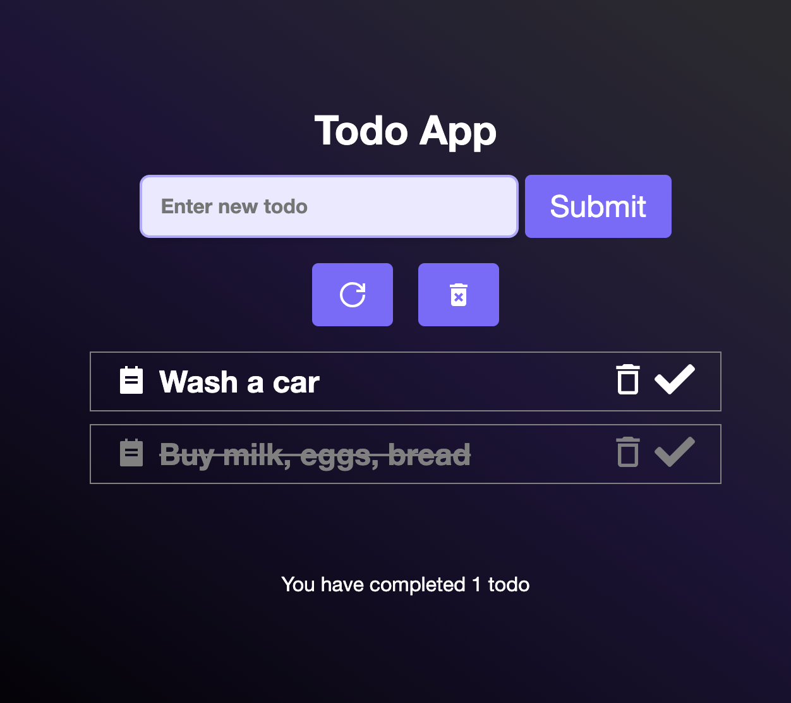

# Todo React App

Todo-App is a simple task management application. It allows users to manage their tasks efficiently.

## Features

-   Add and delete tasks

## Screenshot



## Features

-   Add new tasks
-   Delete tasks
-   Mark tasks as completed
-   Delete only completed tasks
-   Reset all tasks
-   Display the total number of tasks at the bottom

## Installation and Setup

1. Clone the repository:

    ```sh
    git clone https://github.com/andriiafanasiev/Todo-App.git
    ```

2. Navigate to the project directory:

    ```sh
    cd Todo-App
    ```

3. Install dependencies (if applicable):

    ```sh
    npm install
    ```

4. Start the project:
    ```sh
    npm start
    ```

## Technologies Used

-   TypeScript
-   React
-   react-icons

## Author

[Aндрій Афанасьєв](https://github.com/andriiafanasiev)
